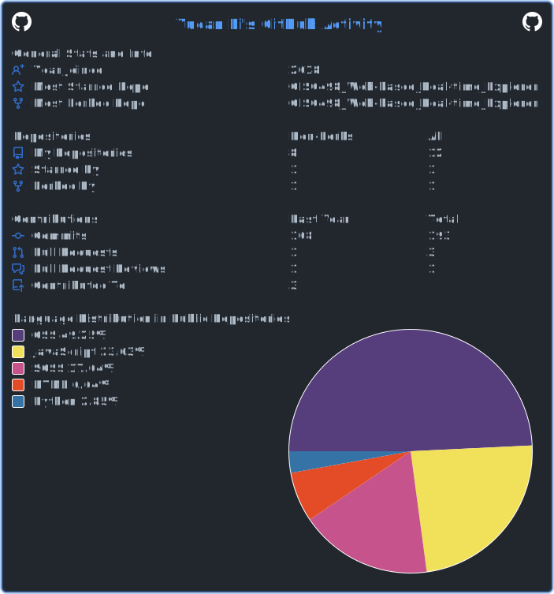

<!--
**BlairLi/BlairLi** is a ✨ _special_ ✨ repository because its `README.md` (this file) appears on your GitHub profile.

Here are some ideas to get you started:

- 🔭 I’m currently working on ...
- 🌱 I’m currently learning ...
- 👯 I’m looking to collaborate on ...
- 🤔 I’m looking for help with ...
- 💬 Ask me about ...
- 📫 How to reach me: ...
- 😄 Pronouns: ...
- ⚡ Fun fact: ...
-->

### Hello there 👋, I'm Yucan Li - aka Blair

(https://github.com/cicirello/user-statistician)

### About Me 👦

- 🌱 I’m currently learning: HCI.
- 🥅 2023 Goals: Learn more about web3
- ⚡ Fun fact: I love Levis Vintage Clothing 501 1947 and play guitar
- 👯 I’m looking to collaborate with any developers!
- 📫 How to reach me: yucanli128@gmail.com
- 😄 Pronouns: he/him

<!-- ### LeetCode Stats
 -->

### Technologies 👨‍💻
 

 

